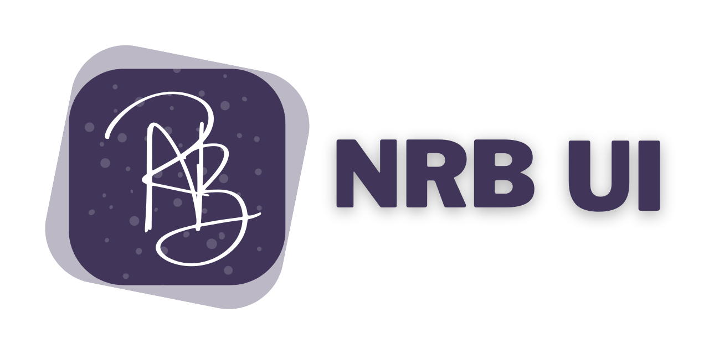

  

<h1 align="center"> ⚡️Build React Apps with Speed ⚡️</h1>

 

 

NRB UI provides a set of accessible, reusable, and composable React
components that make it super easy to create websites and apps.

## Looking for the documentation? 📝

It's the https://nrb-ui.com website for the latest version of Chakra UI.
